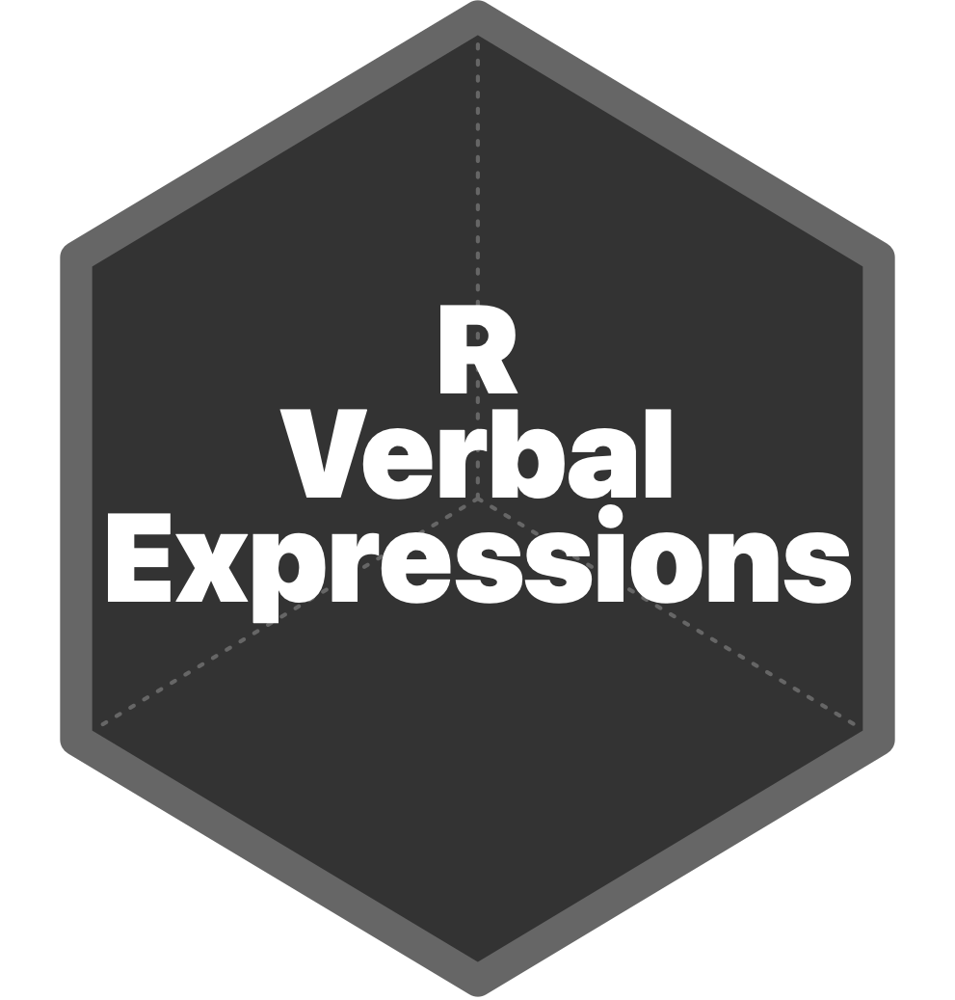

<!-- README.md is generated from README.Rmd. Please edit that file -->

# RVerbalExpressions 

<!-- badges: start -->

[](https://travis-ci.org/VerbalExpressions/RVerbalExpressions)
[](https://ci.appveyor.com/project/tyluRp/rverbalexpressions-4tt0n)
[](https://CRAN.R-project.org/package=RVerbalExpressions)
[](https://cran.r-project.org/package=RVerbalExpressions)
[](https://codecov.io/gh/VerbalExpressions/RVerbalExpressions?branch=master)
<!-- badges: end -->

The goal of `RVerbalExpressions` is to make it easier to construct
regular expressions using grammar and functionality inspired by
[VerbalExpressions](https://github.com/VerbalExpressions). Usage of
`%>%` is encouraged to build expressions in a chain like fashion.

## Installation

Install the released version of `RVerbalExpressions` from CRAN:

``` r
install.packages("RVerbalExpressions")
```

Or install the development version from GitHub with:

``` r
# install.packages("devtools")
devtools::install_github("VerbalExpressions/RVerbalExpressions")
```

## Example

This is a basic example which shows you how to build a regular
expression:

``` r
library(RVerbalExpressions)

# construct an expression
x <- rx_start_of_line() %>% 
  rx_find('http') %>% 
  rx_maybe('s') %>% 
  rx_find('://') %>% 
  rx_maybe('www.') %>% 
  rx_anything_but(' ') %>% 
  rx_end_of_line()

# print the expression
x
#> [1] "^(http)(s)?(\\://)(www\\.)?([^ ]*)$"

# test for a match
grepl(x, "https://www.google.com")
#> [1] TRUE
```

## Other Implementations

You can see an up to date list of all ports on
[VerbalExpressions.github.io](https://VerbalExpressions.github.io).

  - [JavaScript](https://github.com/VerbalExpressions/JSVerbalExpressions)
  - [Ruby](https://github.com/ryan-endacott/verbal_expressions)
  - [C\#](https://github.com/VerbalExpressions/CSharpVerbalExpressions)
  - [Python](https://github.com/VerbalExpressions/PythonVerbalExpressions)
  - [Java](https://github.com/VerbalExpressions/JavaVerbalExpressions)
  - [Groovy](https://github.com/VerbalExpressions/GroovyVerbalExpressions)
  - [PHP](https://github.com/VerbalExpressions/PHPVerbalExpressions)
  - [Haskell](https://github.com/VerbalExpressions/HaskellVerbalExpressions)
  - [Haxe](https://github.com/VerbalExpressions/HaxeVerbalExpressions)
  - [C++](https://github.com/VerbalExpressions/CppVerbalExpressions)
  - [Objective-C](https://github.com/VerbalExpressions/ObjectiveCVerbalExpressions)
  - [Perl](https://github.com/VerbalExpressions/PerlVerbalExpressions)
  - [Swift](https://github.com/VerbalExpressions/SwiftVerbalExpressions)

Additionally, there are two R packages that try to solve the same
problem. I encourage you to check these out:

1.  [rex](https://github.com/kevinushey/rex) by
    [@kevinushey](https://twitter.com/kevin_ushey)
2.  [rebus](https://github.com/richierocks/rebus) by
    [@richierocks](https://twitter.com/richierocks?lang=en)

## Contributing

If you find any issues, typos, etc., please file an issue or submit a
PR. All contributions are welcome\!
